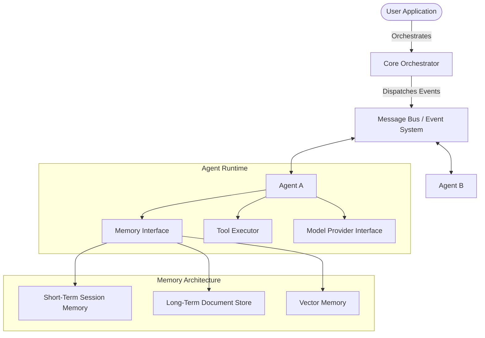
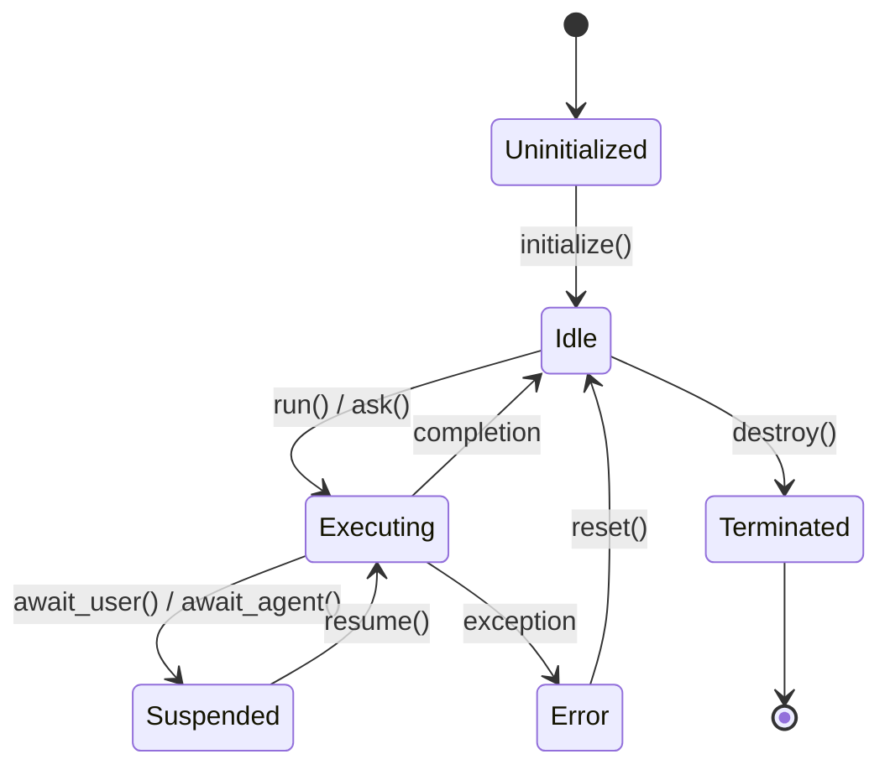
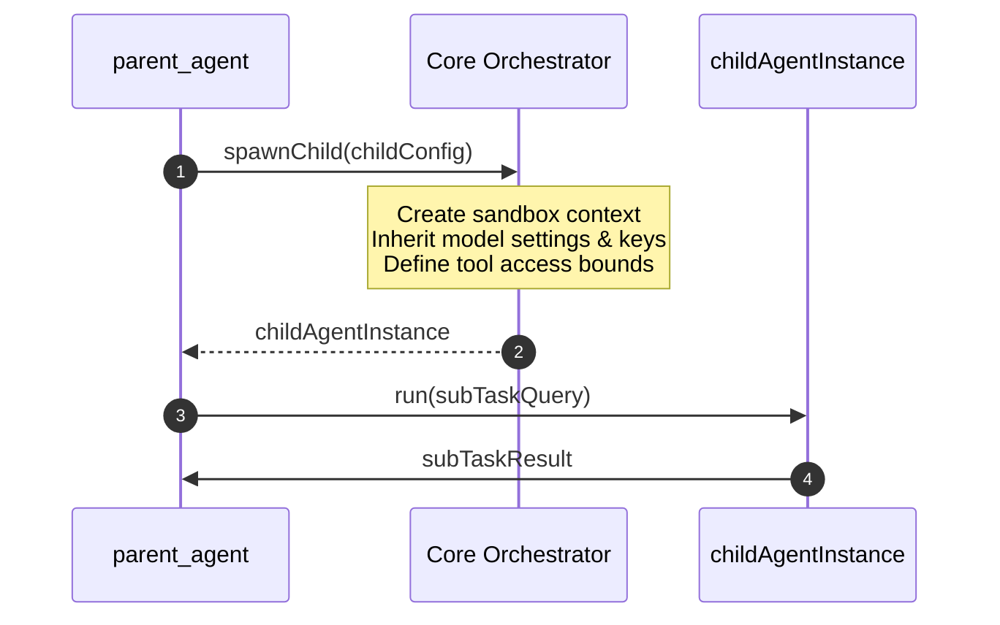

# System Design Architecture (SDA): Open Agent Framework

This document defines the technical architecture, message patterns, memory schemas, and runtime lifecycles for the Open Agent Framework (`@openagents`).

---

## 1. High-Level Architecture & Communication Flow

The Open Agent Framework uses an event-driven core orchestrator that handles routing, lifecycle events, and coordinate components. Agents communicate asynchronously via a shared event-driven Message Bus.



---

## 2. Event System & Message Bus

To support decoupled agent collaboration and workflows, the Message Bus implements a Publisher-Subscriber pattern supporting point-to-point (direct message) and topic-based broadcasting.

### Message Schema

All messages passed through the framework conform to a standard envelope structure:

```typescript
interface MessageEnvelope<T = any> {
  id: string;             // UUIDv4
  parentId?: string;      // For thread tracking & causal ordering
  timestamp: number;      // Epoch milliseconds
  sender: {
    id: string;
    role: string;
  };
  recipient: {
    type: 'agent' | 'broadcast' | 'orchestrator';
    id: string;           // Target agent ID or '*' for broadcast
  };
  topic: string;          // e.g., "agent.task.delegate", "agent.message.text"
  payload: T;             // Message body (e.g. text content, tool inputs, metadata)
  metadata: {
    tokens?: number;
    latencyMs?: number;
    correlationId: string;
  };
}
```

### Event Routing Model

1. **Direct Agent-to-Agent (`ask`)**:
   - `AgentA` calls `await AgentA.ask(AgentB, "Query")`.
   - The Message Bus creates a `MessageEnvelope` with topic `agent.message.ask` and routes it to `AgentB`'s incoming message queue.
   - `AgentB` processes the request and responds with a message on topic `agent.message.reply` referencing the original `parentId`.
2. **Orchestrated Workflows**:
   - The workflow engine publishes state transition events (`workflow.step.started`, `workflow.step.completed`).
   - Agents listen to relevant step transitions and trigger processing when their designated step becomes active.

---

## 3. Memory Architecture

The Memory Layer consists of three decoupled adapters to handle varying retention lifespans and semantics:

```text
┌─────────────────────────────────────────────────────────────────────────┐
│                              Memory Layer                               │
├────────────────────┬────────────────────┬───────────────────────────────┤
│ Short-Term Memory  │  Long-Term Memory  │         Vector Memory         │
├────────────────────┼────────────────────┼───────────────────────────────┤
│ - Ephemeral session│ - Persistent JSON/ │ - Semantic indexing           │
│ - Call stack       │   Key-Value store  │ - Embedding generation        │
│ - Sliding window   │ - MongoDB, SQLite  │ - Chroma, Pinecone, pgvector  │
└────────────────────┴────────────────────┴───────────────────────────────┘
```

### Short-Term Memory (Session Context)
* **Purpose**: Manages active conversation windows, keeping token count within LLM context bounds.
* **Strategies**:
  * **Sliding Window**: Keeps only the last `N` messages.
  * **Summarizer**: Summarizes older messages when approaching the token limit, appending the summary to the system context.

### Long-Term Memory (Document Store)
* **Purpose**: Persistently stores variables, user preferences, and fact sheets across restarts.
* **Storage Adapters**: Supported databases include File System (local JSON), SQLite, and Redis.

### Vector Memory (Semantic Context)
* **Purpose**: Indexes message histories and external documents for similarity search.
* **Flow**:
  1. Texts are chunked via `TextSplitter` (e.g., Recursive Character Text Splitter).
  2. Embeddings are created via the configured Provider.
  3. Vectors are persisted and searched via a unified `VectorStore` adapter.

---

## 4. Agent Lifecycle Management

Agents are managed by the Core Orchestrator through a defined state machine:



### State Definitions
* **Uninitialized**: Config loaded; providers and tools are not yet initialized.
* **Idle**: Ready to receive instructions.
* **Executing**: Prompt synthesis and LLM loop processing (including Tool execution).
* **Suspended**: Paused awaiting user authorization (e.g., human-in-the-loop tool approvals) or awaiting a response from a peer agent.
* **Error**: Execution failed due to network, token limit, or tool exceptions.

---

## 5. Dynamic Agent Spawning

Agents can spawn child agents dynamically to handle subtasks.



### Rules & Inheritance

* **Context Inheritance**: Child agents inherit credentials, model providers, and configuration scopes from the parent unless explicitly overridden.
* **Safety Boundaries**: Parents can restrict a child's tool registry. For example, a child agent spawned by a writer agent cannot access the file write tools if restricted by the parent config.
* **Lifecycle Cascading**: If the parent agent is terminated, all dynamically spawned children are automatically cleaned up and terminated.

---

## 6. Plugin Loading & Tool System

The Framework uses standard TypeScript interfaces to enable extension of both tools and plugins.

### Tool System

```typescript
export interface ToolDefinition<TInput = any, TOutput = any> {
  name: string;
  description: string;
  schema: object; // JSON schema describing TInput
  execute: (args: TInput, context: ExecutionContext) => Promise<TOutput>;
}
```

Tools are loaded into an agent's runtime. The framework verifies that inputs match the defined JSON schema before passing them to the tool's `execute` function.

### Plugin Architecture

Plugins hook directly into lifecycle triggers of the runtime using hook listeners:

```typescript
export interface AgentPlugin {
  id: string;
  onBeforeLLMCall?: (context: ExecutionContext) => Promise<void>;
  onAfterLLMCall?: (result: LLMResponse, context: ExecutionContext) => Promise<void>;
  onToolStart?: (toolName: string, args: any) => Promise<void>;
  onToolEnd?: (toolName: string, output: any) => Promise<void>;
}
```

---

## 7. Vector Storage Abstraction Layer

A simple vector interface allows developers to hook in any vector database (Chroma, Pinecone, Qdrant, PGVector) without changing the agent logic.

```typescript
export interface VectorStoreAdapter {
  initialize(): Promise<void>;
  upsert(documents: Array<{ id: string; vector: number[]; metadata: Record<string, any>; content: string }>): Promise<void>;
  query(queryVector: number[], options: { limit: number; filter?: Record<string, any> }): Promise<Array<{ id: string; score: number; metadata: Record<string, any>; content: string }>>;
  delete(ids: string[]): Promise<void>;
}
```

---

## 8. Verification & Performance Benchmarks

### Latency Budget (Excluding LLM Calls)
* **Message Bus routing**: < 5ms
* **Memory retrieval (short-term & local KV)**: < 10ms
* **Vector lookup (local Chroma/HNSW)**: < 30ms

### Tests to Run
- **Unit Tests**:
  - Event payload validation.
  - State machine transitions (verifying illegal state changes fail).
  - Schema mapping to model format.
- **Integration Tests**:
  - Agent-to-Agent messaging loop back-and-forth execution.
  - Spawning a subagent and verifying it runs within parent constraint limits.
